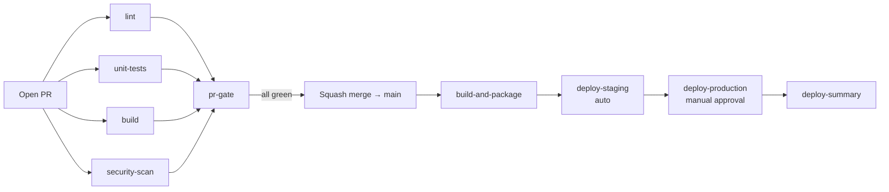

# CI/CD Demo — DevOps Infrastructure Platform

**Category: DevOps 基础设施演示**

A complete DevOps infrastructure platform: Terraform IaC, Kubernetes orchestration, ArgoCD GitOps, Trivy security scanning, and Prometheus + Grafana observability. Includes CI/CD pipelines and basic test automation as validation layer.

## What This Project Demonstrates

```
Code Push → GitHub Actions (CI) → Docker Build & Test → Helm Package
    → ArgoCD (CD) → Kubernetes Deploy → Prometheus Monitoring → Grafana Dashboards
```

### Phase 1: Foundation (Complete)

| Component | Technology | What It Does |
|-----------|-----------|--------------|
| **Infrastructure as Code** | Terraform + Localstack | S3, DynamoDB, 3 environment configs (dev/staging/prod) |
| **Container Orchestration** | Kubernetes (k3d) | 3-node cluster, Jobs, Deployments, Services, Ingress |
| **GitOps** | ArgoCD | 2 apps (dev auto-sync, staging manual), self-healing |
| **Security Scanning** | Trivy + npm audit | 4-layer scanning (filesystem, Docker, IaC, dependencies) |
| **Monitoring** | Prometheus + Grafana | Metrics collection, 2 dashboards (14 panels) |
| **CI Pipeline** | GitHub Actions | 2 active workflows: Docker regression + security scan (位于仓库根 `.github/workflows/`) |
| **Validation Layer** | Cypress + Newman | 16 E2E tests + 18 API assertions (pipeline validation) |
| **Containerization** | Docker Compose | Cypress + Newman in containers, reproducible test env |

### Phase 2: CI/CD Pipeline Integration (Planned)

| Component | Technology | What It Adds |
|-----------|-----------|-------------|
| **Release Management** | Helm Charts | Versioned releases, parameterized deploys, rollback |
| **Pipeline Orchestration** | GitHub Actions | Multi-stage: lint → test → build → deploy dev → deploy staging |
| **Pipeline Alerting** | AlertManager + Slack | Alert on deployment failure, test failure, infra issues |
| **Pipeline Metrics** | Pushgateway | Track build times, test pass rates, deployment frequency |
| **Log Aggregation** | Loki + Promtail | Centralized logging, debug failed deployments in Grafana |

See [WBS.md](docs/project-management/WBS.md) for detailed task breakdown.

## Quick Start

### Run Tests Locally

```bash
cd cicd-demo
npm install
npm test                         # Both Cypress + Newman
npm run test:cypress:headed      # Interactive Cypress
```

### Run in Docker

```bash
npm run docker:test              # Docker containers
npm run docker:test:logs         # With detailed logs
```

### Deploy to Kubernetes (Phase 1)

```bash
# Prerequisites: docker, kubectl, k3d, terraform, helm
# Create cluster
k3d cluster create qa-portfolio --agents 2 --port "8080:80@loadbalancer"

# Deploy infrastructure
cd terraform && terraform init && terraform apply -var-file=environments/dev.tfvars

# Deploy to K8s
cd ../k8s && ./deploy-to-k8s.sh

# Install ArgoCD
cd ../gitops/argocd && ./install-argocd.sh

# Install monitoring
cd ../../monitoring && ./deploy-monitoring.sh
```

### Access Dashboards

```bash
# Grafana (metrics + dashboards)
kubectl port-forward -n monitoring svc/prometheus-grafana 3000:80
# Open http://localhost:3000 (admin / grafana-admin)

# ArgoCD (GitOps deployments)
kubectl port-forward -n argocd svc/argocd-server 9090:443
# Open https://localhost:9090

# Prometheus (raw metrics)
kubectl port-forward -n monitoring svc/prometheus-kube-prometheus-prometheus 9091:9090
```

## Project Structure

```
cicd-demo/
├── .github/
│   └── WORKFLOWS-GUIDE.md          # Workflows 说明（实际 workflows 在仓库根 .github/workflows/）
│
├── cypress/                         # Cypress E2E 测试
│   ├── e2e/
│   │   ├── 01-api-tests.cy.js      #   API 端点验证
│   │   └── 02-ui-tests.cy.js       #   UI 功能验证
│   └── support/                     #   Cypress 支持文件
│
├── postman/                         # Newman API 测试
│   ├── api-collection.json          #   Postman 集合 (18 assertions)
│   └── environment.json             #   环境变量配置
│
├── terraform/                       # Infrastructure as Code
│   ├── main.tf                      #   S3 buckets, DynamoDB table
│   ├── variables.tf                 #   可配置参数
│   ├── outputs.tf                   #   输出定义
│   ├── provider.tf                  #   Provider 配置 (Localstack)
│   ├── backend.tf                   #   S3 远程状态后端
│   ├── modules/                     #   可复用 Terraform 模块
│   └── environments/                #   多环境 tfvars
│       ├── dev.tfvars               #     开发环境
│       ├── staging.tfvars           #     预生产环境
│       └── production.tfvars        #     生产环境
│
├── k8s/                             # Kubernetes 清单文件
│   ├── namespace.yaml               #   qa-portfolio 命名空间
│   ├── deployment.yaml              #   测试结果服务器 (nginx)
│   ├── service.yaml                 #   ClusterIP Service
│   ├── ingress.yaml                 #   外部访问入口
│   ├── configmap.yaml               #   配置数据
│   ├── pvc.yaml                     #   持久化存储 (5Gi)
│   ├── job-cypress.yaml             #   Cypress 测试 Job
│   ├── job-newman.yaml              #   Newman 测试 Job
│   ├── deploy-to-k8s.sh            #   一键部署脚本
│   └── README.md                    #   K8S 部署说明
│
├── helm/qa-portfolio/               # Helm Chart
│   ├── Chart.yaml                   #   Chart 元数据
│   ├── values.yaml                  #   默认值
│   ├── values-staging.yaml          #   Staging 覆盖值
│   ├── values-production.yaml       #   Production 覆盖值
│   └── templates/                   #   K8S 模板
│       ├── deployment.yaml          #     Deployment 模板
│       ├── service.yaml             #     Service 模板
│       ├── ingress.yaml             #     Ingress 模板
│       ├── configmap.yaml           #     ConfigMap 模板
│       ├── namespace.yaml           #     Namespace 模板
│       ├── pvc.yaml                 #     PVC 模板
│       ├── job-cypress.yaml         #     Cypress Job 模板
│       ├── job-newman.yaml          #     Newman Job 模板
│       ├── _helpers.tpl             #     模板助手函数
│       └── NOTES.txt                #     安装后提示
│
├── gitops/argocd/                   # GitOps 配置
│   ├── install-argocd.sh            #   ArgoCD 安装脚本
│   ├── project.yaml                 #   AppProject (RBAC)
│   └── applications/                #   应用定义
│       ├── qa-portfolio-dev.yaml    #     Dev 环境 (auto-sync)
│       └── qa-portfolio-staging.yaml#     Staging 环境 (manual sync)
│
├── monitoring/                      # 可观测性堆栈
│   ├── prometheus-values.yaml       #   Prometheus + Grafana Helm values
│   ├── deploy-monitoring.sh         #   自动化部署脚本
│   ├── verify-monitoring.sh         #   健康检查脚本
│   ├── MONITORING.md                #   监控架构文档
│   ├── dashboards/                  #   Grafana 仪表盘
│   │   ├── cluster-overview.json    #     集群概览 (14 panels)
│   │   └── test-metrics.json        #     测试指标仪表盘
│   ├── grafana/                     #   Grafana 配置
│   └── prometheus/                  #   Prometheus 配置
│
├── security/                        # 安全扫描配置
│   ├── trivy-config.yaml            #   扫描规则、严重度阈值
│   ├── security-report.sh           #   综合报告生成器
│   └── README.md                    #   安全扫描说明
│
├── scripts/                         # 自动化脚本
│   ├── validate-environment.sh      #   环境预检
│   ├── fix-permissions.sh           #   Docker 文件权限修复
│   ├── deploy-helm.sh              #   Helm 部署脚本
│   ├── generate-dashboard.sh        #   仪表盘生成
│   ├── run-regression-test-with-logs.sh  # 回归测试（带日志）
│   ├── track-test-execution.sh      #   测试执行追踪
│   ├── track-test-execution-simple.sh   # 简化版执行追踪
│   └── test-logs/                   #   测试日志输出
│
├── docs/                            # 文档
│   ├── README.md                    #   文档索引
│   ├── architecture/
│   │   └── ARCHITECTURE.md          #     技术架构深度解析
│   ├── guides/
│   │   ├── QUICKSTART.md            #     5 分钟快速上手
│   │   ├── FAQ-GUIDE.md             #     35+ 常见问题解答
│   │   ├── CI-CD-GUIDE.md           #     CI/CD 管道指南
│   │   ├── TROUBLESHOOTING.md       #     故障排查手册
│   │   └── GITHUB-ACTIONS-VERIFICATION.md  # GitHub Actions 验证
│   ├── project-management/
│   │   ├── WBS.md                   #     工作分解结构
│   │   ├── CICD-COMPLETE-ANALYSIS.md#     CI/CD 完整分析
│   │   └── REGRESSION-TEST-RESULT.md#     回归测试结果
│   ├── fixes/                       #   Bug 修复记录
│   │   ├── BUG-LIST.md              #     Bug 清单
│   │   ├── BUGFIX-SUMMARY.md        #     修复摘要
│   │   └── BUG-FIX-LOG-2026-02-21.md#    修复日志
│   ├── diagrams/                    #   架构图（预留）
│   ├── AZURE-VS-GITHUB-ACTIONS.md   #   跨平台 CI/CD 对比
│   ├── VERIFICATION-GUIDE.md        #   验证指南
│   └── PHASE-*.md                   #   各阶段完成报告
│
├── docker-compose.yml               # 容器编排（测试环境）
├── docker-compose.localstack.yml    # Localstack 本地 AWS 模拟
├── Dockerfile.newman                # Newman 容器镜像
├── cypress.config.js                # Cypress 配置
├── package.json                     # NPM 依赖 & 脚本
├── azure-pipelines.yml              # Azure Pipelines 配置参考
├── verify-all-phases.sh             # 全阶段验证脚本
├── create-test-pr.sh                # 测试 PR 创建脚本
├── CLAUDE.md                        # Claude 项目指南
└── SECURITY.md                      # 安全策略
```

## Security Scanning Strategy

### 4-Layer Defense in Depth

| Layer | Tool | Scope | Severity Gate |
|-------|------|-------|---------------|
| Dependency | `npm audit` | JS packages (prod only) | `--audit-level=moderate` → **pipeline fails** |
| Filesystem | Trivy `fs` | Source code + deps | CRITICAL → **pipeline fails** (via Quality Gate job) |
| Container | Trivy `image` | Docker image layers + OS pkgs | Report only (SARIF → GitHub Security Tab) |
| IaC | Trivy `config` | Terraform + K8s manifests | CRITICAL → **pipeline fails** (via Quality Gate job) |

### Quality Gate Design

```
npm-audit ──┐
trivy-fs ───┤ (report mode, exit-code: 0)
trivy-docker┤ → all artifacts uploaded regardless
trivy-iac ──┘
                                ↓
              security-quality-gate (exit-code: 1, CRITICAL only)
              ↓ FAIL on CRITICAL vulnerabilities
```

- **Report jobs** use `exit-code: '0'` — always collect full SARIF artifacts
- **Quality Gate job** uses `exit-code: '1'` for CRITICAL severity only
- Scan results visible in **GitHub Security Tab** (Code scanning alerts) and **Workflow Artifacts**

### Suppressing Known / Accepted Risks

Add entries to `cicd-demo/.trivyignore`:

```
# Format: CVE-ID  # reason | expires: YYYY-MM-DD
CVE-2024-12345  # false positive - not exploitable in our context | expires: 2025-06-01
```


### Current (Phase 1): CI with Manual CD

```
Nightly / Manual ──→ docker-tests.yml ──→ Docker Build + Test ──→ Artifacts
Push / PR / Daily / Manual ──→ security-scan.yml ──→ Trivy + npm audit ──→ SARIF → GitHub Security
```

ArgoCD watches the Git repo and syncs K8s manifests, but there's no automated CI → CD handoff.

### Target (Phase 2): Full CI/CD Pipeline

```
Push ──→ Stage 1: Lint + Unit Test ──→ Stage 2: Build + Security Scan (parallel)
     ──→ Stage 3: E2E Tests ──→ Stage 4: Deploy Dev (auto, Helm)
     ──→ Stage 5: Deploy Staging (manual approval gate)

Pipeline failure ──→ AlertManager ──→ Slack notification
Pipeline metrics ──→ Pushgateway ──→ Prometheus ──→ Grafana dashboard
Pod logs ──→ Promtail ──→ Loki ──→ Grafana log explorer
```

## Infrastructure Overview

### Kubernetes Cluster (k3d)

```
Nodes: 3 (1 server + 2 agents)
Namespaces: qa-portfolio, argocd, monitoring, kube-system
Total Pods: 30+
```

### Namespace Breakdown

| Namespace | Pods | Purpose |
|-----------|------|---------|
| qa-portfolio | 1 | Test results server (nginx) |
| argocd | 7 | GitOps controller, repo server, UI |
| monitoring | 8 | Prometheus, Grafana, AlertManager, Node Exporter |
| kube-system | 9 | CoreDNS, Traefik, Metrics Server |

## GitHub Actions Workflows

| Workflow | Trigger | Purpose |
|----------|---------|---------|
| `cicd-demo-pr.yml` | PR to main (`cicd-demo/**`) | **PR Gate**: lint + unit/contract tests + Docker build + quick security scan (< 5 min) |
| `cicd-demo-deploy.yml` | Push to main (`cicd-demo/**`), manual | **Deploy Pipeline**: Helm package → staging (auto) → production (manual approval) |
| `docker-tests.yml` | Nightly (02:00 UTC), manual | Docker container regression tests (Cypress + Newman) |
| `security-scan.yml` | Push/PR to main (`cicd-demo/**`), daily (03:00 UTC), manual | Trivy filesystem / Docker / IaC + npm audit → SARIF |

### PR → Merge → Deploy 流程

```
┌───────────────────────────────────────────────────────────────────────┐
│  Developer pushes feature branch → opens PR to main                   │
└───────────────────────────────────────────────────────────────────────┘
                                  │
                                  ▼
┌───────────────────────────────────────────────────────────────────────┐
│  cicd-demo-pr.yml (on: pull_request)                                  │
│                                                                       │
│   ┌────────┐  ┌────────────┐  ┌───────┐  ┌──────────────┐             │
│   │  lint  │  │ unit-tests │  │ build │  │ security-scan│  (parallel) │
│   └───┬────┘  └─────┬──────┘  └───┬───┘  └──────┬───────┘             │
│       └─────────────┴─────────────┴─────────────┘                     │
│                          │                                            │
│                          ▼                                            │
│                  ┌───────────────┐                                    │
│                  │   pr-gate     │ ◄── Branch Protection 唯一 Required│
│                  │ (aggregator)  │     Check                          │
│                  └───────┬───────┘                                    │
└──────────────────────────┼────────────────────────────────────────────┘
                           │ ✅ all green
                           ▼
                  ┌────────────────┐
                  │  Squash merge  │
                  │   into main    │
                  └───────┬────────┘
                          │
                          ▼
┌───────────────────────────────────────────────────────────────────────┐
│  cicd-demo-deploy.yml (on: push to main)                              │
│                                                                       │
│   ┌──────────────────┐                                                │
│   │ build-and-package│  (helm lint × 3 envs, helm package)            │
│   └────────┬─────────┘                                                │
│            ▼                                                          │
│   ┌──────────────────┐                                                │
│   │  deploy-staging  │  Environment: staging  (auto)                  │
│   └────────┬─────────┘                                                │
│            ▼                                                          │
│   ┌──────────────────┐                                                │
│   │ deploy-production│  Environment: production  (👤 manual approval) │
│   └────────┬─────────┘                                                │
│            ▼                                                          │
│   ┌──────────────────┐                                                │
│   │  deploy-summary  │  (写入 GITHUB_STEP_SUMMARY)                    │
│   └──────────────────┘                                                │
└───────────────────────────────────────────────────────────────────────┘
```



### Branch Protection 配置（Settings → Branches → `main`）

为保证 PR 必须通过 PR Pipeline 才能合并，需在仓库设置中启用以下规则：

| 设置 | 取值 |
|------|------|
| Require a pull request before merging | ✅ 开启 |
| Require approvals | ≥ 1 |
| Require status checks to pass before merging | ✅ 开启 |
| Required status check | `CICD Demo / PR Gate` |
| Require branches to be up to date before merging | ✅ 开启 |
| Require conversation resolution before merging | ✅ 开启 |

> `pr-gate` 是 `cicd-demo-pr.yml` 中 `needs: [lint, unit-tests, build, security-scan]` 的聚合 job，一处配置即可守住所有 PR 校验。任何子 job 失败时 `pr-gate` 也会失败。

### GitHub Environments 配置（Settings → Environments）

部署流水线使用 GitHub Environments 控制 staging / production 的访问与审批：

| Environment | 配置建议 |
|-------------|----------|
| `staging` | 自动部署；可选 secrets：`STAGING_KUBECONFIG` |
| `production` | Required reviewers ≥ 1（手动审批）；wait timer 可选；secrets：`PROD_KUBECONFIG` |

> 在 GitHub-hosted runner 上 deploy job 默认执行 dry-run（`helm template` 渲染产物作为 artifact 上传）。如需真实集群部署，请取消脚本中注释的 `helm upgrade --install` 行，并在 self-hosted runner 上配置 `KUBECONFIG`。

## Documentation

| Document | What It Covers |
|----------|---------------|
| [ARCHITECTURE.md](docs/architecture/ARCHITECTURE.md) | 技术架构、设计决策、扩展性 |
| [WBS.md](docs/project-management/WBS.md) | Phase 1 (完成) + Phase 2 (计划中) 工作分解 |
| [QUICKSTART.md](docs/guides/QUICKSTART.md) | 5 分钟从零到集群运行 |
| [FAQ-GUIDE.md](docs/guides/FAQ-GUIDE.md) | 35+ Q&A，覆盖 6 个技术领域 |
| [CI-CD-GUIDE.md](docs/guides/CI-CD-GUIDE.md) | CI/CD 管道搭建与集成 |
| [TROUBLESHOOTING.md](docs/guides/TROUBLESHOOTING.md) | 故障排查手册 |
| [Azure vs GitHub Actions](docs/AZURE-VS-GITHUB-ACTIONS.md) | 跨平台 CI/CD 对比 FAQ |
| [MONITORING.md](monitoring/MONITORING.md) | 监控架构与仪表盘配置 |

## FAQ

### 30-Second Pitch

> "I built a complete DevOps platform demonstrating the full CI/CD lifecycle: GitHub Actions pipelines, Docker containerization, Kubernetes orchestration, Terraform IaC, ArgoCD GitOps, security scanning with Trivy, and Prometheus + Grafana monitoring. All deployed to a k3d cluster with 30+ pods across 3 namespaces."

### Key Skills Demonstrated

- **Terraform IaC**: Multi-environment (dev/staging/prod) with Localstack
- **Kubernetes**: Deployments, Jobs, Services, Ingress, PVCs, ConfigMaps, 3-node k3d
- **GitOps**: ArgoCD with auto-sync, self-heal, manual approval gate
- **Security Scanning**: Trivy 4-layer (filesystem, Docker, IaC, deps) + SARIF → GitHub Security
- **Monitoring**: Prometheus metrics, Grafana dashboards (14 panels), PromQL, AlertManager
- **CI/CD Pipeline Design**: security scan 持续检查 + nightly/manual Docker regression
- **Docker**: Multi-container orchestration, custom images, volume caching

### Pre-Demo Checklist

```bash
# Verify cluster
kubectl get nodes                              # 3 nodes
kubectl get pods --all-namespaces | grep -c Running  # 25+ running

# Verify dashboards
kubectl port-forward -n monitoring svc/prometheus-grafana 3000:80 &
kubectl port-forward -n argocd svc/argocd-server 9090:443 &

# Verify tests
npm test                                        # All pass
```

See [FAQ-GUIDE.md](docs/guides/FAQ-GUIDE.md) for 35+ Q&A with detailed answers.
