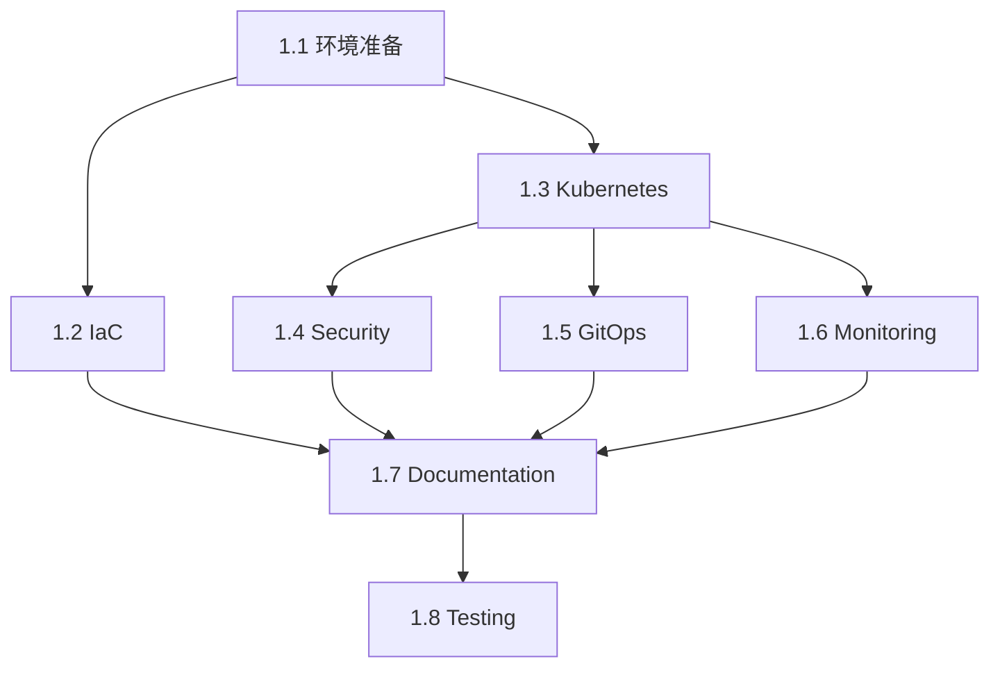

# 📋 DevOps 平台 WBS - 工作分解结构

**项目**: DevOps Platform Enhancement (简化版)
**总工期**: 16 小时（2天）
**开始日期**: TBD
**状态**: 📝 计划阶段

---

## 📊 WBS 层级结构 / Hierarchy

```
1. DevOps Platform Enhancement
   ├── 1.1 环境准备 (Preparation)
   ├── 1.2 Infrastructure as Code (IaC)
   ├── 1.3 Kubernetes Deployment
   ├── 1.4 Security Integration
   ├── 1.5 GitOps Implementation
   ├── 1.6 Monitoring Setup
   ├── 1.7 Documentation
   └── 1.8 Testing & Validation
```

---

## 📝 详细任务分解 / Detailed Task Breakdown

---

### 1.1 环境准备 / Environment Preparation

**预计时间**: 1 小时
**责任人**: 自己
**优先级**: 🔴 高（必须先完成）

| 任务ID | 任务名称 | 描述 | 工时 | 状态 |
|--------|---------|------|------|------|
| 1.1.1 | 安装 Docker Desktop | 确保 Docker 运行正常 | 10min | ⬜ 待开始 |
| 1.1.2 | 安装 kubectl | K8s 命令行工具 | 5min | ⬜ 待开始 |
| 1.1.3 | 安装 k3d | 本地 K8s 集群工具 | 5min | ⬜ 待开始 |
| 1.1.4 | 安装 Terraform | IaC 工具 | 5min | ⬜ 待开始 |
| 1.1.5 | 安装 Helm | K8s 包管理工具 | 5min | ⬜ 待开始 |
| 1.1.6 | 创建 k3d 集群 | 本地测试集群 | 15min | ⬜ 待开始 |
| 1.1.7 | 验证工具版本 | 运行版本检查命令 | 5min | ⬜ 待开始 |
| 1.1.8 | 准备项目分支 | 创建 feature/devops-platform 分支 | 10min | ⬜ 待开始 |

**交付物**:
- [x] 所有工具安装完成
- [x] k3d 集群运行正常
- [x] 新的 Git 分支

**验收标准**:
```bash
docker version          # 输出版本信息
kubectl version         # 输出版本信息
k3d version            # 输出版本信息
terraform version      # 输出版本信息
helm version           # 输出版本信息
k3d cluster list       # 显示 qa-portfolio 集群
```

---

### 1.2 Infrastructure as Code (IaC)

**预计时间**: 4 小时
**责任人**: 自己
**优先级**: 🔴 高
**依赖**: 1.1 完成

| 任务ID | 任务名称 | 描述 | 工时 | 状态 |
|--------|---------|------|------|------|
| 1.2.1 | 创建目录结构 | terraform/{modules,environments} | 10min | ⬜ 待开始 |
| 1.2.2 | 编写 main.tf | 主配置文件 | 45min | ⬜ 待开始 |
| 1.2.3 | 编写 variables.tf | 变量定义 | 30min | ⬜ 待开始 |
| 1.2.4 | 编写 outputs.tf | 输出定义 | 15min | ⬜ 待开始 |
| 1.2.5 | 配置 dev.tfvars | 开发环境变量 | 15min | ⬜ 待开始 |
| 1.2.6 | 配置 staging.tfvars | 预发环境变量 | 15min | ⬜ 待开始 |
| 1.2.7 | 配置 production.tfvars | 生产环境变量 | 15min | ⬜ 待开始 |
| 1.2.8 | 配置 Localstack | AWS 本地模拟 | 30min | ⬜ 待开始 |
| 1.2.9 | Terraform init | 初始化项目 | 5min | ⬜ 待开始 |
| 1.2.10 | Terraform plan | 验证配置 | 15min | ⬜ 待开始 |
| 1.2.11 | Terraform apply | 应用配置（本地） | 15min | ⬜ 待开始 |
| 1.2.12 | 测试环境切换 | 验证多环境配置 | 15min | ⬜ 待开始 |
| 1.2.13 | 编写 README.md | Terraform 使用文档 | 30min | ⬜ 待开始 |

**交付物**:
- [x] terraform/ 目录完整结构
- [x] 可运行的 Terraform 代码（~500 行）
- [x] 3 个环境配置文件
- [x] Terraform README 文档

**验收标准**:
```bash
cd cicd-demo/terraform
terraform init          # 成功
terraform plan         # 无错误
terraform apply -var-file=environments/dev.tfvars  # 成功
```

**文件结构**:
```
terraform/
├── main.tf                    # ~200 lines
├── variables.tf              # ~100 lines
├── outputs.tf                # ~50 lines
├── provider.tf               # ~30 lines
├── backend.tf                # ~20 lines
└── environments/
    ├── dev.tfvars           # ~30 lines
    ├── staging.tfvars       # ~30 lines
    └── production.tfvars    # ~30 lines
```

---

### 1.3 Kubernetes Deployment

**预计时间**: 2.5 小时
**责任人**: 自己
**优先级**: 🔴 高
**依赖**: 1.1 完成

| 任务ID | 任务名称 | 描述 | 工时 | 状态 |
|--------|---------|------|------|------|
| 1.3.1 | 创建 k8s/ 目录 | 创建目录结构 | 5min | ⬜ 待开始 |
| 1.3.2 | 编写 namespace.yaml | 创建命名空间 | 10min | ⬜ 待开始 |
| 1.3.3 | 编写 deployment.yaml | Cypress + Newman 部署 | 45min | ⬜ 待开始 |
| 1.3.4 | 编写 service.yaml | Service 配置 | 20min | ⬜ 待开始 |
| 1.3.5 | 编写 configmap.yaml | 配置文件 | 20min | ⬜ 待开始 |
| 1.3.6 | 编写 ingress.yaml | Ingress 配置 | 20min | ⬜ 待开始 |
| 1.3.7 | 部署到 k3d | kubectl apply -f | 10min | ⬜ 待开始 |
| 1.3.8 | 验证 Pods 运行 | kubectl get pods | 10min | ⬜ 待开始 |
| 1.3.9 | 测试服务访问 | curl / port-forward | 15min | ⬜ 待开始 |
| 1.3.10 | 编写部署脚本 | deploy-to-k8s.sh | 20min | ⬜ 待开始 |
| 1.3.11 | 编写 K8s README | 使用文档 | 25min | ⬜ 待开始 |

**交付物**:
- [x] k8s/ 目录完整配置
- [x] K8s manifests (~300 行)
- [x] 部署脚本
- [x] K8s README

**验收标准**:
```bash
kubectl get pods -n qa-portfolio    # All Running
kubectl get svc -n qa-portfolio     # Services created
kubectl logs <pod-name>             # 日志正常
curl http://localhost:8080          # 服务可访问
```

**文件结构**:
```
k8s/
├── namespace.yaml          # ~10 lines
├── deployment.yaml         # ~120 lines
├── service.yaml           # ~40 lines
├── configmap.yaml         # ~50 lines
├── ingress.yaml           # ~40 lines
├── secrets.example.yaml   # ~30 lines
└── README.md              # ~100 lines
```

---

### 1.4 Security Integration

**预计时间**: 1.5 小时
**责任人**: 自己
**优先级**: 🟡 中高
**依赖**: 1.3 完成（需要镜像）

| 任务ID | 任务名称 | 描述 | 工时 | 状态 |
|--------|---------|------|------|------|
| 1.4.1 | 创建 security/ 目录 | 安全配置目录 | 5min | ⬜ 待开始 |
| 1.4.2 | 配置 Trivy 扫描 | trivy-config.yaml | 20min | ⬜ 待开始 |
| 1.4.3 | 创建 security-scan workflow | GitHub Actions | 30min | ⬜ 待开始 |
| 1.4.4 | 测试 Trivy 扫描 | 本地运行 | 15min | ⬜ 待开始 |
| 1.4.5 | 集成 npm audit | package.json scripts | 10min | ⬜ 待开始 |
| 1.4.6 | 测试 npm audit | 运行并修复 | 15min | ⬜ 待开始 |
| 1.4.7 | 编写安全报告脚本 | security-report.sh | 15min | ⬜ 待开始 |
| 1.4.8 | 编写安全文档 | SECURITY.md | 20min | ⬜ 待开始 |

**交付物**:
- [x] security/ 目录配置
- [x] GitHub Actions security workflow
- [x] 安全扫描脚本
- [x] 安全文档

**验收标准**:
```bash
# 本地测试
trivy image qa-portfolio:latest     # 扫描镜像
npm audit                           # 依赖审计

# CI 测试
git push                            # 触发 security-scan workflow
# GitHub Actions 中查看扫描结果
```

**文件结构**:
```
security/
├── trivy-config.yaml          # ~40 lines
├── security-report.sh         # ~80 lines
└── SECURITY.md                # ~150 lines

.github/workflows/
└── security-scan.yml          # ~100 lines
```

---

### 1.5 GitOps Implementation

**预计时间**: 4 小时
**责任人**: 自己
**优先级**: 🔴 高
**依赖**: 1.3 完成

| 任务ID | 任务名称 | 描述 | 工时 | 状态 |
|--------|---------|------|------|------|
| 1.5.1 | 创建 gitops/ 目录 | GitOps 配置目录 | 5min | ⬜ 待开始 |
| 1.5.2 | 下载 ArgoCD manifests | 官方 YAML | 10min | ⬜ 待开始 |
| 1.5.3 | 编写 install-argocd.sh | 安装脚本 | 20min | ⬜ 待开始 |
| 1.5.4 | 安装 ArgoCD 到 k3d | 执行安装 | 20min | ⬜ 待开始 |
| 1.5.5 | 配置 ArgoCD UI 访问 | Port forward | 10min | ⬜ 待开始 |
| 1.5.6 | 获取 admin 密码 | kubectl get secret | 5min | ⬜ 待开始 |
| 1.5.7 | 创建 Application CRD - dev | qa-portfolio-dev.yaml | 30min | ⬜ 待开始 |
| 1.5.8 | 创建 Application CRD - staging | qa-portfolio-staging.yaml | 20min | ⬜ 待开始 |
| 1.5.9 | 应用 Application | kubectl apply | 10min | ⬜ 待开始 |
| 1.5.10 | 测试自动同步 | 修改 Git → 观察部署 | 30min | ⬜ 待开始 |
| 1.5.11 | 测试手动同步 | ArgoCD UI 操作 | 15min | ⬜ 待开始 |
| 1.5.12 | 测试回滚功能 | History → Rollback | 15min | ⬜ 待开始 |
| 1.5.13 | 配置 Health Check | 健康检查配置 | 20min | ⬜ 待开始 |
| 1.5.14 | 编写 GitOps 文档 | GITOPS.md | 30min | ⬜ 待开始 |

**交付物**:
- [x] ArgoCD 安装和配置
- [x] Application CRDs (2个)
- [x] 安装和部署脚本
- [x] GitOps 文档

**验收标准**:
```bash
# 验证 ArgoCD 运行
kubectl get pods -n argocd      # All Running

# 访问 UI
kubectl port-forward svc/argocd-server -n argocd 8080:443
open https://localhost:8080

# 验证自动同步
# 1. 修改 k8s/deployment.yaml (如改 replicas)
# 2. git add && git commit && git push
# 3. 在 ArgoCD UI 看到自动同步
# 4. kubectl get pods 验证变化生效
```

**文件结构**:
```
gitops/
└── argocd/
    ├── install-argocd.sh          # ~50 lines
    ├── applications/
    │   ├── qa-portfolio-dev.yaml      # ~60 lines
    │   └── qa-portfolio-staging.yaml  # ~60 lines
    ├── README.md                  # ~200 lines
    └── screenshots/
        ├── argocd-ui.png
        └── auto-sync.png
```

---

### 1.6 Monitoring Setup

**预计时间**: 4 小时
**责任人**: 自己
**优先级**: 🟡 中高
**依赖**: 1.3 完成

| 任务ID | 任务名称 | 描述 | 工时 | 状态 |
|--------|---------|------|------|------|
| 1.6.1 | 创建 monitoring/ 目录 | 监控配置目录 | 5min | ⬜ 待开始 |
| 1.6.2 | 添加 Prometheus Helm repo | helm repo add | 5min | ⬜ 待开始 |
| 1.6.3 | 编写 prometheus-values.yaml | 自定义配置 | 40min | ⬜ 待开始 |
| 1.6.4 | 部署 Prometheus | helm install | 15min | ⬜ 待开始 |
| 1.6.5 | 验证 Prometheus 运行 | kubectl get pods | 10min | ⬜ 待开始 |
| 1.6.6 | 添加 Grafana Helm repo | helm repo add | 5min | ⬜ 待开始 |
| 1.6.7 | 编写 grafana-values.yaml | 自定义配置 | 40min | ⬜ 待开始 |
| 1.6.8 | 部署 Grafana | helm install | 15min | ⬜ 待开始 |
| 1.6.9 | 配置 Grafana 访问 | Port forward + 密码 | 10min | ⬜ 待开始 |
| 1.6.10 | 配置 Prometheus 数据源 | Grafana UI | 15min | ⬜ 待开始 |
| 1.6.11 | 创建 Dashboard 1 | Cluster Overview | 40min | ⬜ 待开始 |
| 1.6.12 | 创建 Dashboard 2 | Test Metrics | 40min | ⬜ 待开始 |
| 1.6.13 | 导出 Dashboard JSON | 保存到 Git | 10min | ⬜ 待开始 |
| 1.6.14 | 编写监控文档 | MONITORING.md | 30min | ⬜ 待开始 |

**交付物**:
- [x] Prometheus 部署配置
- [x] Grafana 部署配置
- [x] 2 个 Grafana dashboards
- [x] 监控文档

**验收标准**:
```bash
# 验证 Prometheus
kubectl get pods -n monitoring          # prometheus-server Running
kubectl port-forward -n monitoring svc/prometheus-server 9090:80
open http://localhost:9090              # Prometheus UI 可访问

# 验证 Grafana
kubectl port-forward -n monitoring svc/grafana 3000:80
open http://localhost:3000              # Grafana UI 可访问
# 使用 admin/admin 登录
# 查看 2 个 dashboards 显示数据
```

**文件结构**:
```
monitoring/
├── prometheus-values.yaml     # ~150 lines
├── grafana-values.yaml        # ~100 lines
├── dashboards/
│   ├── cluster-overview.json  # ~500 lines
│   └── test-metrics.json      # ~400 lines
├── deploy-monitoring.sh       # ~60 lines
└── MONITORING.md              # ~250 lines
```

---

### 1.7 Documentation

**预计时间**: 2 小时
**责任人**: 自己
**优先级**: 🟡 中
**依赖**: 所有功能完成

| 任务ID | 任务名称 | 描述 | 工时 | 状态 |
|--------|---------|------|------|------|
| 1.7.1 | 编写 QUICKSTART.md | 快速开始指南 | 30min | ⬜ 待开始 |
| 1.7.2 | 编写 ARCHITECTURE.md | 架构文档 | 30min | ⬜ 待开始 |
| 1.7.3 | 创建架构图 | draw.io / mermaid | 30min | ⬜ 待开始 |
| 1.7.4 | 编写 INTERVIEW-POINTS.md | 面试讨论要点 | 30min | ⬜ 待开始 |
| 1.7.5 | 编写 DEMO-SCRIPT.md | 演示脚本 | 20min | ⬜ 待开始 |
| 1.7.6 | 更新主 README.md | 添加 DevOps 部分 | 20min | ⬜ 待开始 |
| 1.7.7 | 创建 TROUBLESHOOTING.md | 故障排除 | 20min | ⬜ 待开始 |

**交付物**:
- [x] 7 个文档文件
- [x] 架构图（PNG/SVG）
- [x] 更新的主 README

**验收标准**:
- 所有文档语法正确
- 链接可点击
- 代码示例可运行
- 架构图清晰

**文件结构**:
```
docs/
├── DEVOPS-QUICKSTART.md       # ~400 lines
├── ARCHITECTURE-SIMPLE.md     # ~300 lines
├── INTERVIEW-POINTS.md        # ~500 lines
├── DEMO-SCRIPT.md             # ~200 lines
├── TROUBLESHOOTING.md         # ~300 lines
└── diagrams/
    ├── architecture.png
    └── gitops-workflow.png

README.md                      # 更新 +100 lines
```

---

### 1.8 Testing & Validation

**预计时间**: 1 小时
**责任人**: 自己
**优先级**: 🔴 高（最后）
**依赖**: 所有任务完成

| 任务ID | 任务名称 | 描述 | 工时 | 状态 |
|--------|---------|------|------|------|
| 1.8.1 | 端到端测试 | 完整流程测试 | 20min | ⬜ 待开始 |
| 1.8.2 | 文档验证 | 检查所有链接和命令 | 15min | ⬜ 待开始 |
| 1.8.3 | 演示排练 | 完整演示一遍 | 15min | ⬜ 待开始 |
| 1.8.4 | 截图收集 | 收集所有演示截图 | 10min | ⬜ 待开始 |
| 1.8.5 | 清理测试数据 | 删除临时文件 | 10min | ⬜ 待开始 |

**交付物**:
- [x] 测试报告
- [x] 演示截图集
- [x] 验收确认

**验收标准**:
```bash
# 完整测试流程
./scripts/setup-k3d.sh              # 成功
cd terraform && terraform apply     # 成功
./scripts/deploy-to-k8s.sh          # 成功
./gitops/argocd/install-argocd.sh   # 成功
./monitoring/deploy-monitoring.sh   # 成功

# 验证所有服务
kubectl get pods --all-namespaces   # All Running
curl http://localhost:8080          # 应用可访问
open http://localhost:3000          # Grafana 可访问
open http://localhost:8080          # ArgoCD 可访问
```

---

## 📅 甘特图 / Gantt Chart

### Day 1 (8 小时)

```
时间           任务                              进度
08:00-09:00   1.1 环境准备                      ████████████████████ 100%
09:00-13:00   1.2 Infrastructure as Code       ████████████████████ 100%
14:00-16:30   1.3 Kubernetes Deployment        ████████████████████ 100%
16:30-18:00   1.4 Security Integration         ████████████████████ 100%
```

### Day 2 (8 小时)

```
时间           任务                              进度
09:00-13:00   1.5 GitOps Implementation        ████████████████████ 100%
14:00-18:00   1.6 Monitoring Setup             ████████████████████ 100%
18:00-20:00   1.7 Documentation                ████████████████████ 100%
20:00-21:00   1.8 Testing & Validation         ████████████████████ 100%
```

---

## ✅ 检查清单 / Checklist

### Phase 1: Preparation (1h)
- [ ] 1.1.1 Docker Desktop 安装
- [ ] 1.1.2 kubectl 安装
- [ ] 1.1.3 k3d 安装
- [ ] 1.1.4 Terraform 安装
- [ ] 1.1.5 Helm 安装
- [ ] 1.1.6 创建 k3d 集群
- [ ] 1.1.7 验证工具版本
- [ ] 1.1.8 创建项目分支

### Phase 2: IaC (4h)
- [ ] 1.2.1-1.2.7 Terraform 代码编写
- [ ] 1.2.8 Localstack 配置
- [ ] 1.2.9-1.2.11 Terraform 初始化和应用
- [ ] 1.2.12 测试环境切换
- [ ] 1.2.13 编写文档

### Phase 3: Kubernetes (2.5h)
- [ ] 1.3.1-1.3.6 K8s manifests 编写
- [ ] 1.3.7-1.3.9 部署和验证
- [ ] 1.3.10-1.3.11 脚本和文档

### Phase 4: Security (1.5h)
- [ ] 1.4.1-1.4.4 Trivy 集成
- [ ] 1.4.5-1.4.6 npm audit 集成
- [ ] 1.4.7-1.4.8 脚本和文档

### Phase 5: GitOps (4h)
- [ ] 1.5.1-1.5.6 ArgoCD 安装
- [ ] 1.5.7-1.5.9 Application CRDs
- [ ] 1.5.10-1.5.12 测试同步和回滚
- [ ] 1.5.13-1.5.14 配置和文档

### Phase 6: Monitoring (4h)
- [ ] 1.6.1-1.6.5 Prometheus 部署
- [ ] 1.6.6-1.6.10 Grafana 部署
- [ ] 1.6.11-1.6.13 Dashboards 创建
- [ ] 1.6.14 文档编写

### Phase 7: Documentation (2h)
- [ ] 1.7.1-1.7.7 文档编写

### Phase 8: Testing (1h)
- [ ] 1.8.1-1.8.5 测试和验证

---

## 📊 进度跟踪表 / Progress Tracking

| 阶段 | 任务数 | 已完成 | 进度 | 预计工时 | 实际工时 | 状态 |
|------|--------|--------|------|----------|----------|------|
| 1.1 环境准备 | 8 | 0 | 0% | 1h | - | ⬜ 未开始 |
| 1.2 IaC | 13 | 0 | 0% | 4h | - | ⬜ 未开始 |
| 1.3 Kubernetes | 11 | 0 | 0% | 2.5h | - | ⬜ 未开始 |
| 1.4 Security | 8 | 0 | 0% | 1.5h | - | ⬜ 未开始 |
| 1.5 GitOps | 14 | 0 | 0% | 4h | - | ⬜ 未开始 |
| 1.6 Monitoring | 14 | 0 | 0% | 4h | - | ⬜ 未开始 |
| 1.7 Documentation | 7 | 0 | 0% | 2h | - | ⬜ 未开始 |
| 1.8 Testing | 5 | 0 | 0% | 1h | - | ⬜ 未开始 |
| **总计** | **80** | **0** | **0%** | **20h** | **0h** | ⬜ 未开始 |

**注**: 预计 20h 包含 buffer，实际核心工作 16h

---

## 🎯 里程碑 / Milestones

| 里程碑 | 描述 | 目标日期 | 状态 |
|--------|------|----------|------|
| M1 | 环境准备完成 | Day 1, 09:00 | ⬜ |
| M2 | IaC 实施完成 | Day 1, 13:00 | ⬜ |
| M3 | K8s + Security 完成 | Day 1, 18:00 | ⬜ |
| M4 | GitOps 实施完成 | Day 2, 13:00 | ⬜ |
| M5 | Monitoring 完成 | Day 2, 18:00 | ⬜ |
| M6 | 文档和测试完成 | Day 2, 21:00 | ⬜ |

---

## 🔗 依赖关系 / Dependencies



**关键路径**: 1.1 → 1.3 → 1.5 → 1.6 → 1.7 → 1.8

**可并行任务**:
- 1.2 (IaC) 和 1.3 (K8s) 可以同时进行不同部分
- 1.5 (GitOps) 和 1.6 (Monitoring) 独立，可并行
- 1.4 (Security) 可以最后集成

---

## 📝 每日总结模板 / Daily Summary Template

### Day 1 总结

**日期**: ______
**工作时长**: ______ 小时

**已完成任务**:
- [ ] 1.1 环境准备
- [ ] 1.2 IaC
- [ ] 1.3 Kubernetes
- [ ] 1.4 Security

**遇到的问题**:
1.
2.

**解决方案**:
1.
2.

**明天计划**:
- [ ] 1.5 GitOps
- [ ] 1.6 Monitoring
- [ ] 1.7 Documentation

---

### Day 2 总结

**日期**: ______
**工作时长**: ______ 小时

**已完成任务**:
- [ ] 1.5 GitOps
- [ ] 1.6 Monitoring
- [ ] 1.7 Documentation
- [ ] 1.8 Testing

**项目成果**:
- 新增代码: ______ 行
- 新增文档: ______ 字
- 新增文件: ______ 个

**后续计划**:
- [ ] 演示准备
- [ ] 面试练习
- [ ] 可选扩展

---

## 🚀 快速启动命令 / Quick Start Commands

### 一键创建所有目录结构

```bash
cd /home/michael/repos/michael-zhou-qa-portfolio/cicd-demo

# 创建所有目录
mkdir -p terraform/{modules,environments}
mkdir -p k8s
mkdir -p gitops/argocd/applications
mkdir -p monitoring/{prometheus,grafana,dashboards}
mkdir -p security
mkdir -p scripts
mkdir -p docs/diagrams

echo "✅ 所有目录结构已创建"
```

### 验证环境准备

```bash
#!/bin/bash
# 验证所有工具安装

echo "🔍 验证环境准备..."

command -v docker >/dev/null 2>&1 && echo "✅ Docker" || echo "❌ Docker 未安装"
command -v kubectl >/dev/null 2>&1 && echo "✅ kubectl" || echo "❌ kubectl 未安装"
command -v k3d >/dev/null 2>&1 && echo "✅ k3d" || echo "❌ k3d 未安装"
command -v terraform >/dev/null 2>&1 && echo "✅ Terraform" || echo "❌ Terraform 未安装"
command -v helm >/dev/null 2>&1 && echo "✅ Helm" || echo "❌ Helm 未安装"

k3d cluster list | grep -q qa-portfolio && echo "✅ k3d cluster" || echo "⚠️  k3d cluster 未创建"
```

---

## 📞 下一步行动 / Next Actions

### 准备好开始了吗？

**请确认**:
1. [ ] 我已阅读完 WBS
2. [ ] 我理解任务分解
3. [ ] 我有连续 16 小时（2天）时间
4. [ ] 我准备好开始 1.1 环境准备

**开始方式**:

**选项 A**: 现在立即开始
- 回复: "开始 Day 1, Task 1.1"
- 我会引导您完成环境准备

**选项 B**: 稍后开始
- 告诉我计划开始时间
- 我会在那时提醒您

**选项 C**: 调整计划
- 告诉我需要调整的地方
- 我会修改 WBS

---

**WBS 版本**: 1.0
**创建日期**: 2026-02-27
**状态**: 📝 等待开始
**预计完成**: 2 天后

🚀 **准备好了吗？让我们开始吧！**
