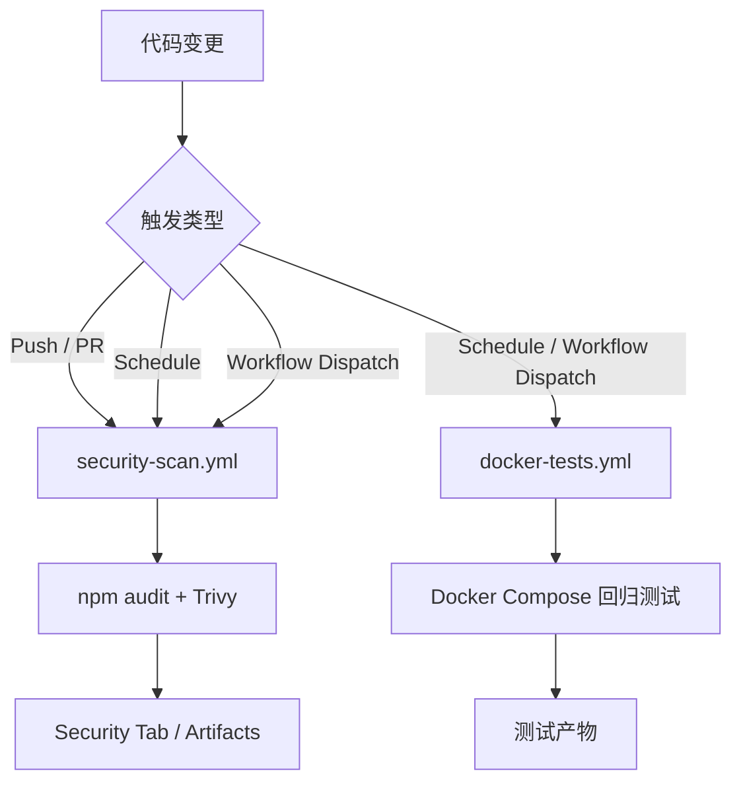

# CI/CD Guide

## 当前有效 workflow

| Workflow | Trigger | Runtime | Purpose |
|----------|---------|---------|---------|
| `docker-tests.yml` | `schedule`, `workflow_dispatch` | Docker | 回归测试与产物归档 |
| `security-scan.yml` | `push`, `pull_request`, `schedule`, `workflow_dispatch` | GitHub-hosted runner | npm audit + Trivy 安全扫描 |

## 执行策略

### `docker-tests.yml`
- 适合夜间回归或手动演示
- 使用 `docker compose` 构建并运行 Cypress / Newman 容器
- 始终上传测试产物，便于失败排查

### `security-scan.yml`
- 在 `cicd-demo/**` 相关改动的 push / PR 上自动运行
- 额外执行每日定时扫描，发现新披露漏洞
- 产出 JSON / SARIF / 文本报告，供 GitHub Security 与 artifact 使用

## 当前流程图



## 维护说明

- 当前仓库根目录不再保留 `pr-checks.yml`、`pipeline.yml`、`helm-deploy.yml`
- 这些名称如果出现在旧的设计/复盘文档中，均表示**历史方案**
- 需要新增项目级 CI 时，优先复用 `.github/actions/setup-node-project` 和 `.github/actions/setup-python-project`

## 文件位置

```text
.github/workflows/
├── docker-tests.yml
├── security-scan.yml
└── ... 其他项目级 workflow
```
