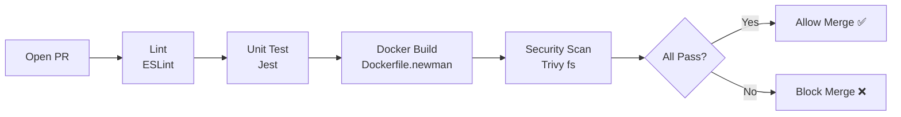
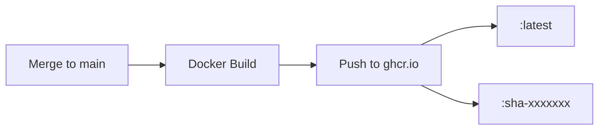

# PR & Deploy Pipeline Implementation Plan

> **For agentic workers:** REQUIRED SUB-SKILL: Use superpowers:subagent-driven-development (recommended) or superpowers:executing-plans to implement this plan task-by-task. Steps use checkbox (`- [ ]`) syntax for tracking.

**Goal:** Implement Issue #242 — 完整的 PR→CI→Merge→CD 流水线，展示 lint + unit test + Docker build + security scan on PR，merge 后自动推送 Docker image 到 ghcr.io。

**Architecture:** 两条独立 workflow：`pr-pipeline.yml`（PR 阶段：lint→unit-test→build→security，串行 needs 依赖）；`deploy.yml`（push to main：build + push to ghcr.io）。Jest unit test 和 jest.config.js 新建在 `cicd-demo/` 下。

**Tech Stack:** GitHub Actions, Jest 29, ESLint 8, Docker BuildKit, aquasecurity/trivy-action, ghcr.io (GITHUB_TOKEN)

---

## File Map

| Action | Path | Responsibility |
|--------|------|---------------|
| Create | `.github/workflows/pr-pipeline.yml` | PR 触发的完整 CI 流水线 |
| Create | `.github/workflows/deploy.yml` | push to main 触发的 CD 流水线 |
| Create | `cicd-demo/jest.config.js` | Jest 配置（testMatch, coverage threshold）|
| Create | `cicd-demo/tests/unit/utils.test.js` | Jest 示例单元测试（9个测试用例）|
| Modify | `cicd-demo/package.json` | 新增 `test:unit` script，devDependencies 加 jest |
| Modify | `cicd-demo/README.md` | 新增 Mermaid 流程图章节 |

**不修改：** `.github/workflows/security-scan.yml`（独立存在，不合并）

---

## Task 1: Jest 单元测试基础设施

**Files:**
- Create: `cicd-demo/jest.config.js`
- Create: `cicd-demo/tests/unit/utils.test.js`
- Modify: `cicd-demo/package.json`

- [ ] **Step 1: 在 cicd-demo/package.json 添加 jest**

在 `scripts` 末尾加：
```json
"test:unit": "jest --coverage"
```

在 `devDependencies` 加：
```json
"jest": "^29.7.0"
```

- [ ] **Step 2: 创建 `cicd-demo/jest.config.js`**

```js
module.exports = {
  testMatch: ['**/tests/unit/**/*.test.js'],
  coverageThreshold: {
    global: { branches: 70, functions: 80, lines: 80, statements: 80 },
  },
};
```

- [ ] **Step 3: 创建 `cicd-demo/tests/unit/utils.test.js`**

```js
// Unit tests for utility functions (Jest example — FR-TEST-005)

function formatStatus(code) {
  if (code >= 200 && code < 300) return 'success';
  if (code >= 400 && code < 500) return 'client-error';
  if (code >= 500) return 'server-error';
  return 'unknown';
}

function buildApiUrl(base, path) {
  if (!base || !path) throw new Error('base and path are required');
  return `${base.replace(/\/$/, '')}/${path.replace(/^\//, '')}`;
}

function isValidEmail(email) {
  return /^[^\s@]+@[^\s@]+\.[^\s@]+$/.test(email);
}

describe('formatStatus', () => {
  test('UT-001: 2xx returns success', () => {
    expect(formatStatus(200)).toBe('success');
    expect(formatStatus(201)).toBe('success');
  });
  test('UT-002: 4xx returns client-error', () => {
    expect(formatStatus(404)).toBe('client-error');
  });
  test('UT-003: 5xx returns server-error', () => {
    expect(formatStatus(500)).toBe('server-error');
  });
  test('UT-004: unknown code returns unknown', () => {
    expect(formatStatus(100)).toBe('unknown');
  });
});

describe('buildApiUrl', () => {
  test('UT-005: joins base and path correctly', () => {
    expect(buildApiUrl('https://api.example.com', 'users')).toBe('https://api.example.com/users');
  });
  test('UT-006: trims trailing slash from base', () => {
    expect(buildApiUrl('https://api.example.com/', '/users')).toBe('https://api.example.com/users');
  });
  test('UT-007: throws when base is missing', () => {
    expect(() => buildApiUrl('', 'users')).toThrow('base and path are required');
  });
});

describe('isValidEmail', () => {
  test('UT-008: valid email returns true', () => {
    expect(isValidEmail('michael@example.com')).toBe(true);
  });
  test('UT-009: invalid email returns false', () => {
    expect(isValidEmail('not-an-email')).toBe(false);
  });
});
```

- [ ] **Step 4: 本地验证 Jest 跑通**

```bash
cd cicd-demo && npm install && npm run test:unit
```
期望：9/9 tests pass，coverage report 生成

- [ ] **Step 5: Commit**

```bash
git add cicd-demo/package.json cicd-demo/jest.config.js cicd-demo/tests/unit/utils.test.js
git commit -m "test: add Jest unit test setup with 9 example test cases (FR-TEST-005)"
```

---

## Task 2: PR Pipeline Workflow

**Files:**
- Create: `.github/workflows/pr-pipeline.yml`

- [ ] **Step 1: 创建 `.github/workflows/pr-pipeline.yml`**

```yaml
name: PR Pipeline

on:
  pull_request:
    branches: [main]

concurrency:
  group: pr-pipeline-${{ github.ref }}
  cancel-in-progress: true

jobs:
  lint:
    name: Lint
    runs-on: ubuntu-latest
    defaults:
      run:
        working-directory: cicd-demo
    steps:
      - uses: actions/checkout@v4
      - uses: actions/setup-node@v4
        with:
          node-version: '20'
          cache: npm
          cache-dependency-path: cicd-demo/package-lock.json
      - run: npm ci
      - run: npm run lint

  unit-test:
    name: Unit Test (Jest)
    runs-on: ubuntu-latest
    needs: lint
    defaults:
      run:
        working-directory: cicd-demo
    steps:
      - uses: actions/checkout@v4
      - uses: actions/setup-node@v4
        with:
          node-version: '20'
          cache: npm
          cache-dependency-path: cicd-demo/package-lock.json
      - run: npm ci
      - run: npm run test:unit
      - uses: actions/upload-artifact@v4
        if: always()
        with:
          name: jest-coverage
          path: cicd-demo/coverage/
          retention-days: 7

  build:
    name: Docker Build
    runs-on: ubuntu-latest
    needs: unit-test
    steps:
      - uses: actions/checkout@v4
      - uses: docker/setup-buildx-action@v3
      - name: Build Docker image (no push)
        uses: docker/build-push-action@v6
        with:
          context: cicd-demo
          file: cicd-demo/Dockerfile.newman
          push: false
          tags: qa-newman-demo:pr-${{ github.event.number }}
          cache-from: type=gha
          cache-to: type=gha,mode=max

  security-scan:
    name: Security Scan (Trivy)
    runs-on: ubuntu-latest
    needs: build
    permissions:
      contents: read
      security-events: write
    steps:
      - uses: actions/checkout@v4
      - name: Trivy filesystem scan
        uses: aquasecurity/trivy-action@v0.35.0
        with:
          scan-type: fs
          scan-ref: cicd-demo/
          severity: CRITICAL,HIGH
          exit-code: '1'
          format: sarif
          output: trivy-results.sarif
      - uses: github/codeql-action/upload-sarif@v3
        if: always()
        with:
          sarif_file: trivy-results.sarif
```

- [ ] **Step 2: Commit**

```bash
git add .github/workflows/pr-pipeline.yml
git commit -m "ci: add PR pipeline — lint → unit-test → docker build → security scan (FR-CICD-001, FR-CICD-002)"
```

---

## Task 3: Deploy Pipeline Workflow

**Files:**
- Create: `.github/workflows/deploy.yml`

- [ ] **Step 1: 创建 `.github/workflows/deploy.yml`**

```yaml
name: Deploy Pipeline

on:
  push:
    branches: [main]
    paths:
      - 'cicd-demo/**'
      - '.github/workflows/deploy.yml'

concurrency:
  group: deploy-${{ github.ref }}
  cancel-in-progress: false

jobs:
  build-and-push:
    name: Build & Push to ghcr.io
    runs-on: ubuntu-latest
    permissions:
      contents: read
      packages: write
    steps:
      - uses: actions/checkout@v4

      - uses: docker/setup-buildx-action@v3

      - name: Login to GitHub Container Registry
        uses: docker/login-action@v3
        with:
          registry: ghcr.io
          username: ${{ github.actor }}
          password: ${{ secrets.GITHUB_TOKEN }}

      - name: Extract metadata
        id: meta
        uses: docker/metadata-action@v5
        with:
          images: ghcr.io/${{ github.repository }}/qa-newman-demo
          tags: |
            type=sha,prefix=sha-
            type=raw,value=latest

      - name: Build and push Docker image
        uses: docker/build-push-action@v6
        with:
          context: cicd-demo
          file: cicd-demo/Dockerfile.newman
          push: true
          tags: ${{ steps.meta.outputs.tags }}
          labels: ${{ steps.meta.outputs.labels }}
          cache-from: type=gha
          cache-to: type=gha,mode=max
```

- [ ] **Step 2: Commit**

```bash
git add .github/workflows/deploy.yml
git commit -m "cd: add deploy pipeline — build and push Docker image to ghcr.io on merge to main (FR-CICD-003)"
```

---

## Task 4: README 流程图

**Files:**
- Modify: `cicd-demo/README.md`（在文件顶部 Overview 章节后插入新章节）

- [ ] **Step 1: 在 README 中找到合适位置，插入以下章节**

```markdown
## 🔄 CI/CD Pipeline Architecture

### PR Pipeline (on: pull_request → main)



### Deploy Pipeline (on: push → main)



### Pipeline Flow Summary

| Stage | Trigger | Jobs | Gate |
|-------|---------|------|------|
| CI | PR opened/updated | lint → unit-test → build → security | All must pass |
| CD | Merge to main | build-and-push | Auto on success |
```

- [ ] **Step 2: Commit**

```bash
git add cicd-demo/README.md
git commit -m "docs: add CI/CD pipeline architecture diagram to README (FR-CICD-005)"
```

---

## Task 5: Branch Protection Rule（手动操作）

这步无法用代码完成，需在 GitHub Settings 手动配置。

- [ ] **Step 1: 前往** `https://github.com/zhoujuxi2028/michael-zhou-qa-portfolio/settings/branches`
- [ ] **Step 2: 点击 "Add branch protection rule"**
- [ ] **Step 3: Branch name pattern 填** `main`
- [ ] **Step 4: 勾选以下选项：**
  - ✅ Require a pull request before merging
  - ✅ Require status checks to pass before merging
    - 搜索并添加：`Lint`, `Unit Test (Jest)`, `Docker Build`, `Security Scan (Trivy)`
  - ✅ Require branches to be up to date before merging
- [ ] **Step 5: 点击 Save changes**

---

## Task 6: 最终 PR 创建

- [ ] **Step 1: Push 分支**

```bash
git push -u origin feat/issue-242-pr-deploy-pipeline
```

- [ ] **Step 2: 创建 PR，关联 Issue #242**

```bash
gh pr create \
  --title "feat: add PR pipeline and deploy pipeline (Issue #242)" \
  --body "Closes #242" \
  --base main
```

---

## 验证清单

- [ ] 提一个测试 PR → Actions tab 出现 `PR Pipeline` workflow
- [ ] 4 个 job 串行执行：lint → unit-test → build → security
- [ ] 任意 job 失败 → PR 显示红色 ❌，无法 merge
- [ ] Merge 到 main → Actions tab 出现 `Deploy Pipeline` workflow
- [ ] `ghcr.io/zhoujuxi2028/michael-zhou-qa-portfolio/qa-newman-demo:latest` 镜像可见
- [ ] README 中 Mermaid 流程图正确渲染
